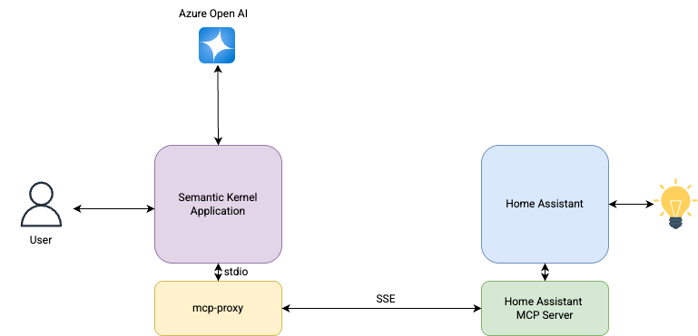

# Semantic Kernel Examples
This repository contains a collection of my Semantic Kernel examples. I'm sharing the projects I'm working on with the community in the hope that they'll be helpful, inspiring, or spark collaboration.

## Semantic Kernel with Home Assistant MCP Integration

This project demonstrates how to build an AI agent that can control and query your Home Assistant smart home devices using the Model Context Protocol (MCP) integration. The agent (`se_agent_homeassistant.py`) uses Semantic Kernel and it enables natural language interactions with your smart home.

### Architecture



The architecture diagram above illustrates the integration between Semantic Kernel and Home Assistant using the Model Context Protocol (MCP). Home Assistant exposes its MCP Server using Server-Sent Events (SSE) protocol, while Semantic Kernel's MCP implementation supports Standard I/O (stdio). To bridge this gap, an MCP proxy is used to translate between these protocols. This proxy enables seamless communication between Semantic Kernel's natural language processing capabilities and Home Assistant's device control functionality, without requiring modifications to either platform.

### How It Works

The agent uses:
- **Semantic Kernel**: To build a smart agent with reasoning capabilities
- **Azure OpenAI**: For natural language understanding and generation
- **MCP Protocol**: To integrate with Home Assistant API
- **Bidirectional Communication**: For real-time interactions with your smart home

### Setup Requirements

1. An Azure OpenAI resource
2. Home Assistant server running the MCP integration
3. Environment variables for authentication (in a `.env` file)

### Home Assistant Configuration

To properly set up the integration with your Home Assistant instance:

1. **Enable MCP Server Integration**: 
   - Follow the official documentation at https://www.home-assistant.io/integrations/mcp_server/ to enable the MCP Server integration in your Home Assistant instance.
   - The MCP Server generates a secure URL endpoint that the Semantic Kernel agent will connect to.

2. **Select Devices for Assistants**: 
   - In your Home Assistant UI, navigate to Settings → Assistants
   - Select the devices you want to expose to the MCP Server integration
   - Only selected devices will be accessible through the Semantic Kernel agent

3. **Generate Long-Lived Access Token**:
   - In your Home Assistant UI, go to your profile (click on your username in the bottom left)
   - Scroll down to "Long-Lived Access Tokens" section
   - Click "Create Token", provide a name (e.g., "Semantic Kernel Agent")
   - Copy the generated token immediately (it will only be shown once)
   - Add this token to your `.env` file as `HA_API_ACCESS_TOKEN=your_token_here`

   **Example `.env` file:**
   ```
   AZURE_OPENAI_DEPLOYMENT_NAME=gpt-35-turbo
   AZURE_OPENAI_ENDPOINT=https://<open api instance>.openai.azure.com/
   AZURE_OPENAI_API_KEY=<Open API Key>
   AZURE_OPENAI_CHAT_DEPLOYMENT_NAME=gpt-35-turbo
   OPENAI_CHAT_MODEL_ID=gpt-35-turbo

   HA_API_ACCESS_TOKEN=<Home Assistant Long Lived Token>
   ```

4. **Network Configuration**: 
   - Ensure your Semantic Kernel agent can reach the Home Assistant MCP endpoint
   - Update the `SSE_URL` in the `se_agent_homeassistant.py` file to match your Home Assistant instance URL
   - Set the proper `HA_API_ACCESS_TOKEN` in your environment variables or `.env` file

5. **Test Connectivity**:
   - Before running the agent, verify that your Home Assistant instance is accessible from the environment where you're running the agent

### Example Interactions

Here are some examples of how you can interact with your smart home through this agent:

**Querying Device Status:**

```
User > What's the status of the office light?
Assistant > The status of the office light is currently 'on' with a brightness level of 255
```

**Controlling Devices:**

```
User > Turn off the that light please
Assistant > The office light has been turned off.
```

```
User > What's the temperature in the living room?
Assistant > The temperature in the living room is 28.5°C.
```

**Complex Queries:**

```
User > Which lights are currently on in the house?
Assistant > The following lights are currently on in the house:
1. Living Light with a brightness level of 255
2. Master Pendant Light with a brightness level of 98
3. Living Mood Lights with a brightness level of 172
4. Kitchen Strip with a brightness level of 133
```

### Running the Agent

To run the agent, use the following command:

```bash
python se_agent_homeassistant.py
```

Then start interacting with your Home Assistant through natural language!

### Extending Functionality

This agent can be extended to:
- Create scenes or routines
- Integrate with additional Home Assistant components
- Implement context-aware automation based on user preferences

Feel free to customize and build upon this example for your specific smart home setup.

